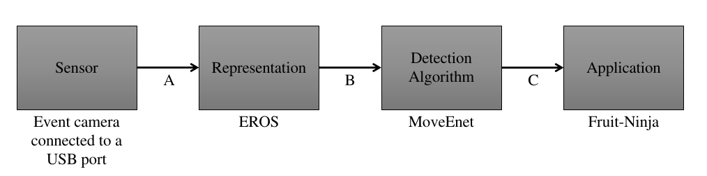

# Fruit Ninja

> Fruit Ninja is a mobile game developed by Halfbrick Studios that released in April 2010 on the iOS App Store. In Fruit Ninja, the player slices fruit with a blade controlled via the touch screen. As the fruit is thrown onto the screen, the player swipes their finger across the screen to create a slicing motion, attempting to slice the fruit in half.

- **Topics**: Physics, 3D Models, Particle Effects
- **Version**: Unity 2020.3 (LTS)
- [**Original Download**](https://github.com/zigurous/unity-fruit-ninja-tutorial/archive/refs/heads/main.zip)
- [**Watch Video**](https://youtu.be/xTT1Ae_ifhM)

# Fruit Ninja with human pose based gameplay

The Fruit Ninja game was combined with Human Pose Estimation with Event Camera to create a game where you move your arms to slice the fruit.

A = Event packets from the atis_bridge 
B = EROS frame-like representation 
C = 13-point skeleton 

## Techincal specification: 
 - The system has been tested on Ubuntu 20.04 LTS and pop_os 20.04 LTS
 - 2 Docker images are available offline (Dockerfiles available online too) for systems with and without GPU.
 - The Fruit-ninja game is available as an executable for Linux. Another can be created for Windows on demand. The project is also available on this repository to run with Unity software installation.
 - YARP is used as middleware for the entire process

## Resources available:
 - Event-Human 3.6m dataset is available in multiple formats for training 
 - A subset of Event-Human 3.6m dataset is available from the validation set, for the leaderboard (qualitative tests with PCK accuracy of the 2 Hand Positions)
 - DHP19 dataset also available (but different resolution from the camera)